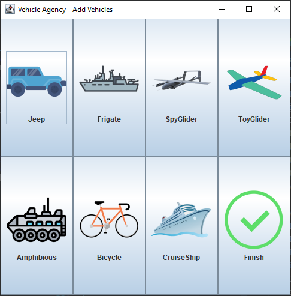
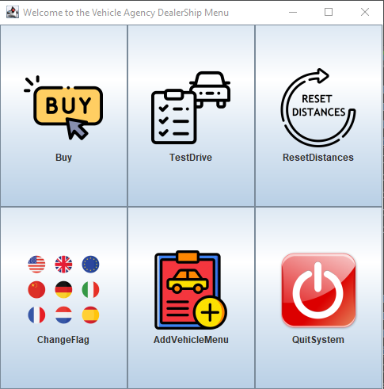

# vehicle-project-java

## A vehicle dealership project in Java, with Gui and Design Patterns.

### Using advanced principles of object-oriented programming, Polymorphism ,Inheritance, interfaces and abstract classes, correct division into files, documentation, Efficiency use of constants, readable names, Files Read/Write, multithreading , and more.

#### The vehicle agency project maintains a pool of various vehicles with options to Add, Buy, testDrive, and more.

 

##### implemented so far:
Polymorphism ,Inheritance, interfaces and abstract classes, correct division into files, documentation, Efficiency use of constants:
An abstract Main Vehicle class with general attributes.
3 abstract classes that extend the main class: Marine vehicles, Air vehicles and Land vehicles.
And the Vehicle Classes: Jeep, Frigate, SpyGlider, ToyGlider, Amphibious, Bicycle, CruiseShip.
A Vehicle can be motorized or not motorized {interface}.
A Vehicle has a means of transportation (typeOfLicense of MINI/LIMIT/UNLIMITED) {interface}.
the above hierarchy within the package of transport tools. 
Note that means of transportation is an abstract class. 
Motorized or non-motorized is behavior and are implemented as interfaces
And as above commercial implemented as an interface.
Functionality of the JFrame menus and JButtons

##### more to be implemented in the future:
multithreading for better performance.
more Functionality options for the user.
And more.

## To run the program, Run the main from 'MainMenu' Class
### Or download the JAR file attached: 'VehicleAgency.jar' (requires the latest JDK (20 or above))